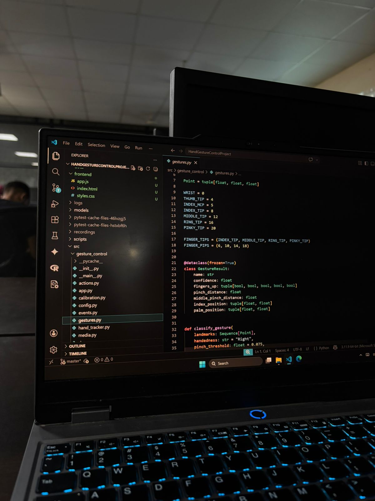
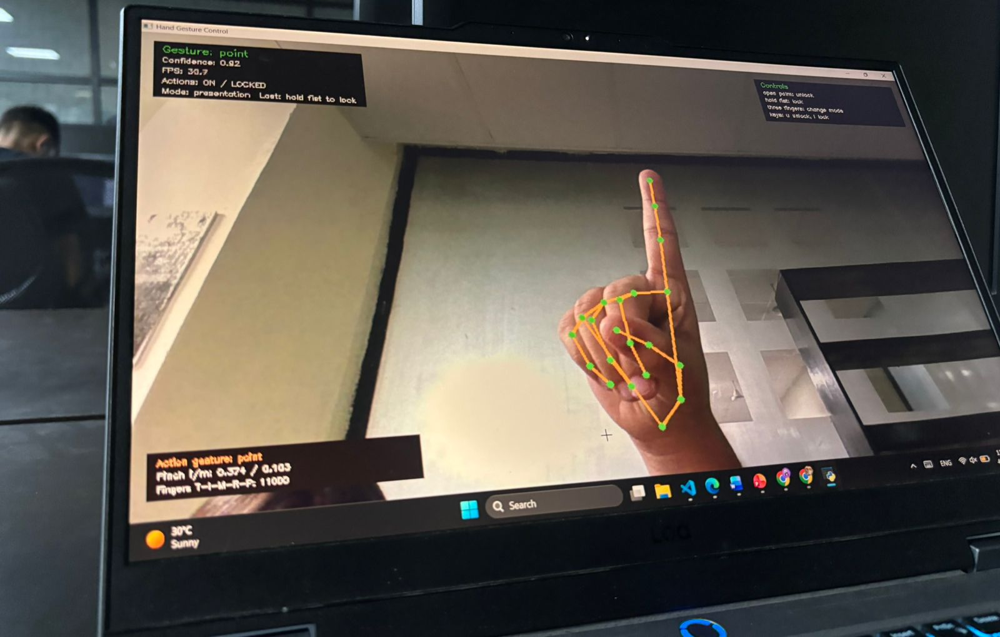
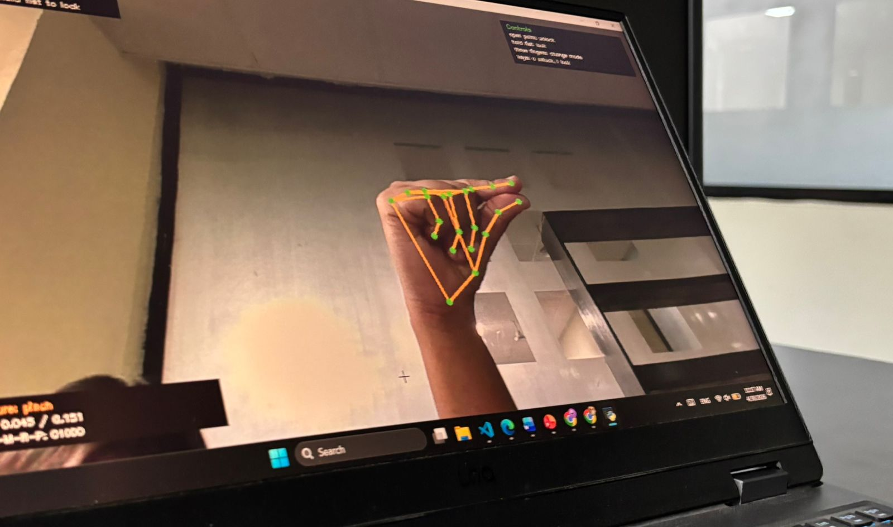
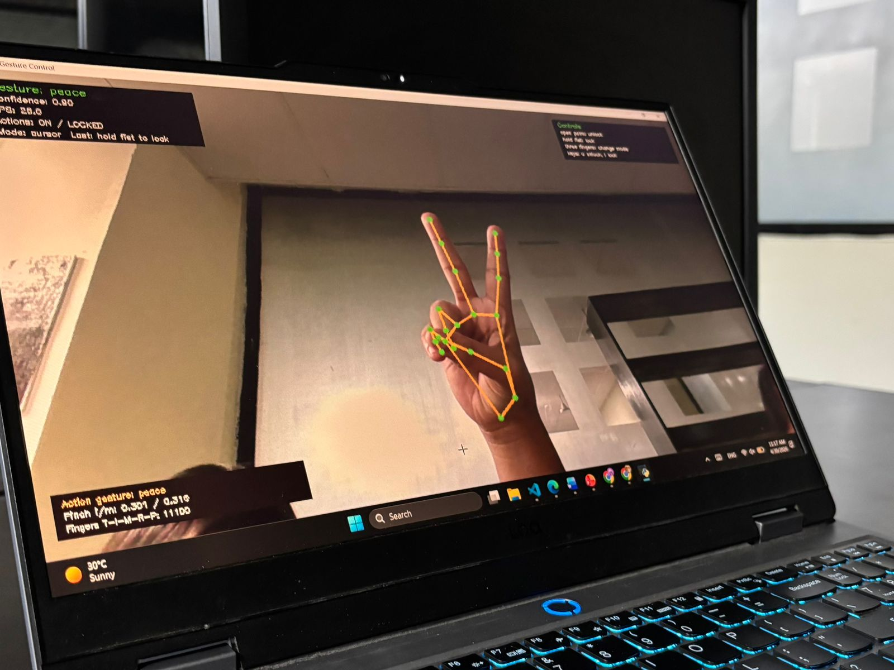

# Hand Gesture Control

A real-time computer vision interface that lets users control a computer through hand gestures. The system uses a webcam to detect hand landmarks, classifies gestures from hand geometry, smooths noisy predictions, and maps stable gestures to practical actions such as cursor movement, volume adjustment, shortcuts, media control, browser navigation, presentation control, and QR-based file sharing.

## Project Preview

| Live gesture tracking | Gesture recognition states |
| --- | --- |
|  |  |
|  |  |

## Key Features

- Real-time hand tracking from webcam video.
- 21-landmark hand pose detection using MediaPipe.
- Cursor mode with point-to-move, pinch-click, drag, scroll, and right-click support.
- Volume mode controlled by thumb-index distance.
- Shortcut, media, browser, and presentation control modes.
- YouTube-friendly media gestures for next video, previous video, and play/pause.
- QR-based local file sharing from laptop to phone or another computer.
- Safety controls including preview mode, open-palm unlock, hold-fist lock, cooldowns, and gesture smoothing.
- Calibration profiles for sensitivity, pinch distance, and shortcut tuning.
- Event logging, snapshots, recording support, and Windows executable packaging.
- Optional Chrome control panel with live mode, FPS, lock, and sensitivity controls.
- Polished local presentation frontend with day/night mode.

## Tech Stack

- Python
- OpenCV
- MediaPipe
- NumPy
- PyAutoGUI
- PyCAW
- PyInstaller
- HTML, CSS, and JavaScript
- Chrome Extension Manifest V3

## How It Works

1. OpenCV captures frames from the webcam.
2. MediaPipe detects 21 hand landmarks in real time.
3. The gesture layer calculates finger states and landmark distances.
4. One Euro filtering and temporal smoothing reduce landmark jitter.
5. A finite state machine debounces gestures and controls action safety.
6. The action engine maps stable gestures to system actions.
7. Safety rules prevent accidental triggering while controlling the computer.

## Gesture Controls

```text
open palm       unlock controls
hold fist       lock controls
three fingers   cycle mode

cursor mode:
point           move cursor
pinch           click on release
pinch hold      drag and drop
thumbs up       right click
peace           scroll

volume mode:
thumb-index     set volume from distance

shortcut mode:
point           Alt+Tab
peace           play/pause
pinch           screenshot snip

media mode:
point           next video
peace           play/pause
pinch           previous video
thumbs up       mute

browser mode:
point           open browser
peace           open browser tab
pinch           close tab
thumbs up       reopen closed tab

presentation mode:
point           next slide
peace           previous slide
pinch           start slideshow
thumbs up       end slideshow

share mode:
point           copy transfer link
peace           open transfer page
pinch           copy and open transfer page
phone camera    scan QR code
```

## Setup

Use Python 3.10 or 3.11.

```powershell
python -m venv .venv
.\.venv\Scripts\Activate.ps1
python -m pip install --upgrade pip
pip install -r requirements.txt
pip install -e .
```

On the first run, the hand landmark model is cached in the `models/` folder.

## Run

No-command launch:

```text
Double-click Start Gesture Control.bat
```

For file sharing, either double-click `Start Gesture Control Share.bat` and choose a file, or drag a file onto it.

Preview mode:

```powershell
python -m gesture_control --camera -1 --profile config/default_profile.json --show-debug
```

Real control mode:

```powershell
python -m gesture_control --camera -1 --enable-actions --profile config/my_profile.json --show-debug --ui-scale 0.5
```

File transfer demo:

```powershell
python -m gesture_control --camera -1 --enable-actions --profile config/my_profile.json --share-path "path\to\demo.pdf" --show-debug --ui-scale 0.5
```

Chrome extension bridge:

```powershell
python -m gesture_control --camera -1 --enable-actions --enable-extension --profile config/default_profile.json --show-debug
```

Then open `chrome://extensions`, enable Developer mode, choose **Load unpacked**, and select the `extension` folder.

To let the extension start the desktop app, run this once:

```text
Install Extension Launcher.bat
```

After that, open the extension popup and click **Start Desktop App**.

To start automatically when Windows starts, double-click:

```text
Install Background Startup.bat
```

To remove that behavior, double-click:

```text
Remove Background Startup.bat
```

## Presentation Frontend

Open the local project frontend:

```powershell
start frontend\index.html
```

The frontend includes the project overview, architecture, feature summary, image gallery, demo command, and day/night mode.

## File Sharing

To share one file with a phone:

```powershell
python -m gesture_control --camera -1 --enable-actions --share-path "path\to\demo.pdf" --show-debug
```

The app starts a local Wi-Fi server and shows a QR code. Scanning the QR code from a phone opens the download flow. The phone and laptop must be connected to the same Wi-Fi network.

## Calibration

Create a custom profile:

```powershell
python -m gesture_control --calibrate-output config/my_profile.json
```

Use the saved profile:

```powershell
python -m gesture_control --profile config/my_profile.json
```

## Build Executable

```powershell
powershell -ExecutionPolicy Bypass -File scripts/build_exe.ps1
```

The executable is created at:

```text
dist/GestureControl/GestureControl.exe
```

## Testing

```powershell
pytest
```

The test suite covers gesture classification, action mapping, calibration, event logging, file sharing, media utilities, and app behavior.

## Applied AI Explanation

This is an Applied AI project because it integrates a pretrained computer vision model into a real interaction workflow. MediaPipe detects hand landmarks from camera frames, and the application layer converts those landmark predictions into stable gestures and system actions.

The base hand landmark model was not trained from scratch. The main engineering contribution is the decision layer: gesture classification, smoothing, thresholds, calibration, safety logic, and automation.

## Repository Structure

```text
config/                  Gesture tuning profiles
docs/                    Demo and explanation notes
frontend/                Local presentation frontend
extension/               Chrome control panel for live desktop control
scripts/                 Build and entry scripts
src/gesture_control/     Main application package
tests/                   Automated tests
```

## Resume Summary

Built a real-time gesture-controlled computer interaction system using OpenCV and MediaPipe, enabling cursor movement, volume control, shortcuts, browser actions, presentation control, media navigation, and QR-based local file transfer. Engineered gesture classification, temporal smoothing, calibration, safety locks, event logging, and Windows packaging for a reliable Applied AI user experience.

